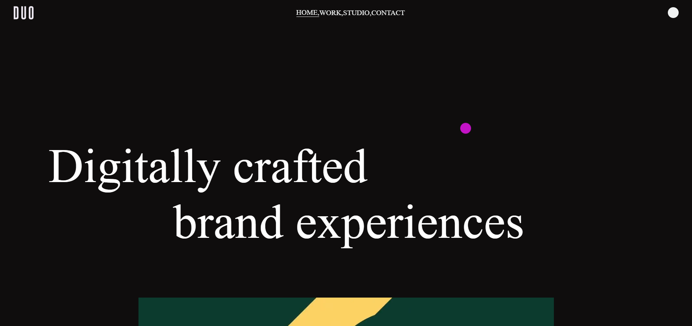
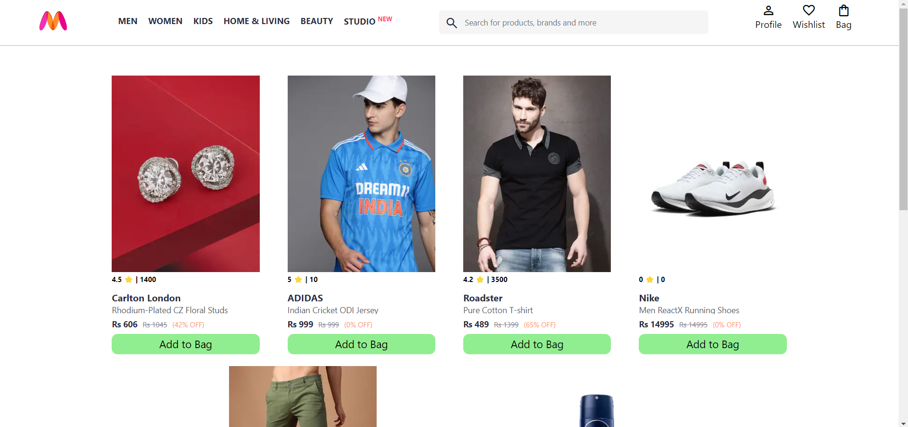
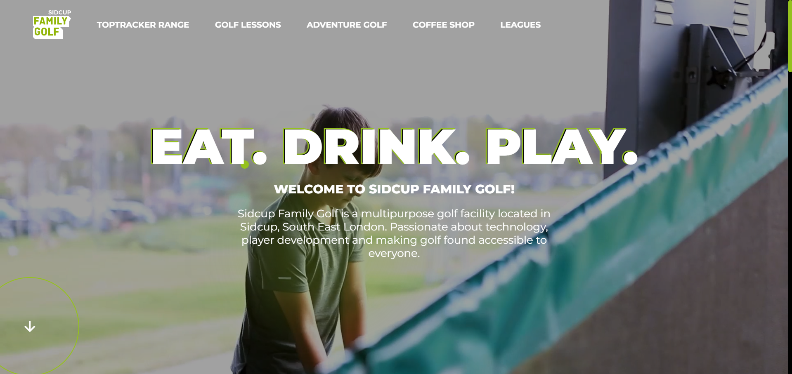
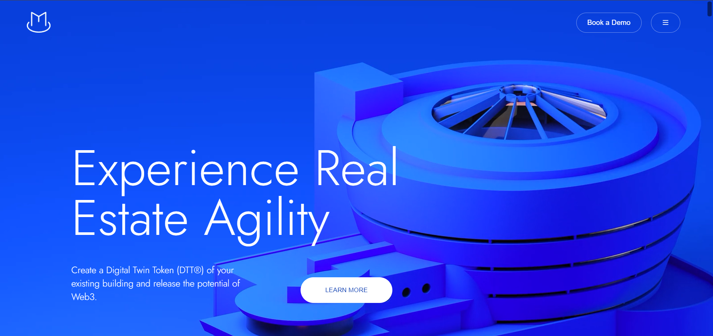
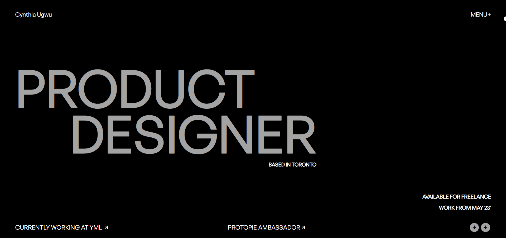

# Website Replication & Clones

This project showcases a collection of website clones that replicate popular designs using HTML, CSS, and JavaScript. The slider navigation allows you to browse through different cloned websites, each designed with unique functionality.

## Features

- **Navigation Bar**: A responsive and interactive navigation bar with an animated hover effect.
- **Website Slider**: A dynamic slider to navigate between multiple website clones.
- **Toggle Menu**: A collapsible menu for better user experience on mobile devices.
- **Cloned Websites**:
  - **Magma's Website Clone**: Utilizes canvas and JavaScript for 3D effects.
  - **Awwards Portfolio**: A clone of Cynthia Ugway's portfolio.
  - **Duo Studio Clone**: Built with GSAP and Locomotive Scroll for smooth animations.
  - **Myntra Clone**: Features a shopping cart system where users can add items and view their cart.
  - **Sidcup Family Gulf's Clone**: A visually appealing website for a golf company.
  - **Wizard-X Clone**: Showcases animations using GSAP.

## Technologies Used

- **HTML5**: For structuring the web pages.
- **CSS3**: For styling and layout with custom animations and hover effects.
- **JavaScript**: To handle the slider functionality and interactive elements.

## How to Use

1. Clone the repository:
   ```bash
   git clone https://github.com/your-username/your-repo-name.git

2. Open index.html in your browser to view the website.

## Project Structure
    ```bash
    .
    ├── index.html       # Main entry point for the website
    ├── style.css        # Contains all the styling rules
    ├── script.js        # JavaScript to handle interactive functionality
    └── Media/           # Folder containing images for website clones
    ```

## Screenshots
1. Duo Studio
    
2. Myntra
    
3. Sydcup Family Gulf
    
4. Wizard-X
    
5 Magma
    
6. Awwards Portfolio
    

## Credits
- **Magma Website:** Based on the original design by [Magma](https://thisismagma.com/).
- **Awwards Portfolio:** Inspired by [Cynthia Ugway's portfolio](https://www.cynthiaugwu.com/).
- **Duo Studio:** A clone inspired by [Duo Studio](https://duo-studio.co/).
- **Myntra:** An e-commerce clone based on [Myntra](https://www.myntra.com).
- **Sidcup Family Gulf:** Based on the [Sidcup Family Gulf company website](https://sidcupfamilygolf.com/).
- **Wizard-X:** A clone inspired by Wizard-X.

## License

This project is licensed under the MIT License - see the LICENSE file for details.
```bash
    You can modify the placeholder URLs and other details to suit your project. Let me know if you need further customization!

